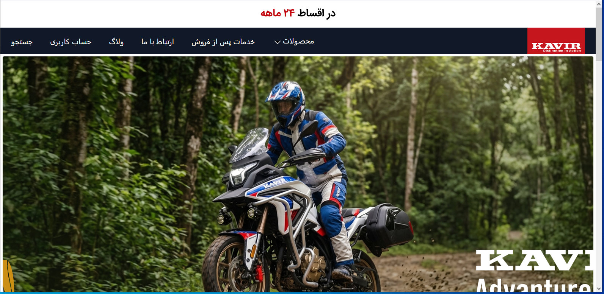
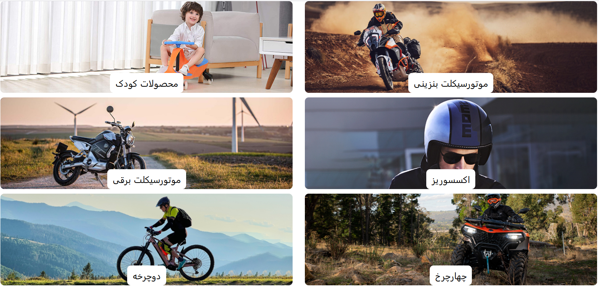
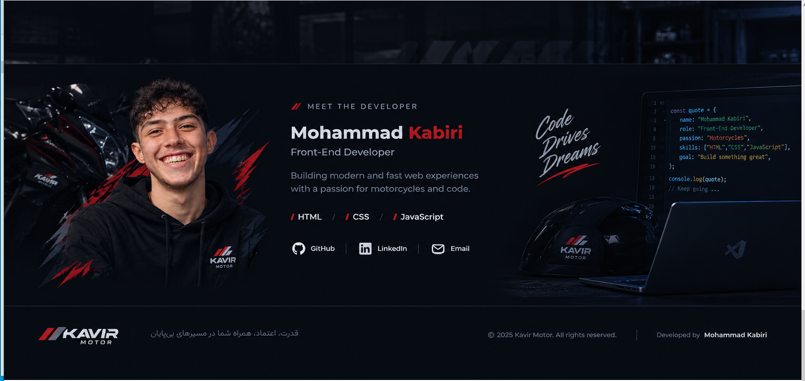

# Kavir Test Clone

A front-end practice project inspired by the Kavir website.

## 🚀 Technologies

- HTML5
- CSS3
- Tailwind CSS

## 📌 About The Project

This project was created as a front-end practice project to improve my skills in building modern and responsive websites.

The design and layout are inspired by the Kavir website.

## 🖼️ Screenshots

### Home Page

### Section 2

### Section 3

### Section 4

## 🛠️ Built With

- HTML
- CSS
- Tailwind CSS
- JavaScript

## 👨‍💻 Author

Mohammad Kabiri

GitHub: [mhmdkbyry908-art](https://github.com/mhmdkbyry908-art)
